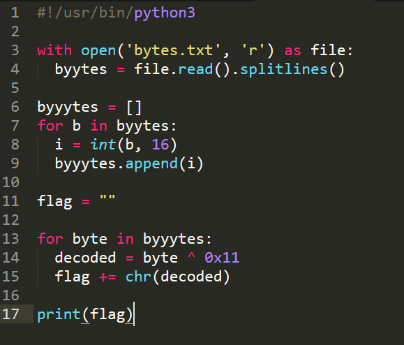
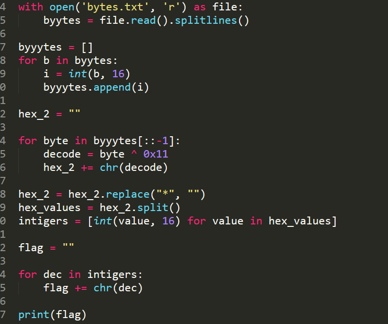

## title: All Father's Wisdom | RE | 270 Solves

**Resolver:** Yxzi

## description:

We found this binary in the backroom, its been marked as "The All Fathers Wisdom" - See hex for further details. Not sure if its just old and hex should be text, or they mean the literal hex.
Anyway can you get this 'wisdom' out of the binary for us?

## Solution:

<code>[11:51:44]:[michal@HACKERMAN]$ file the-all-fathers-wisdom
the-all-fathers-wisdom: ELF 64-bit LSB executable, x86-64, version 1 (SYSV), dynamically linked, interpre
ter /lib64/ld-linux-x86-64.so.2, BuildID[sha1]=01eec917a381d4efe62ed137f1349127f4faeeaa, for GNU/Linux 4.
4.0, not stripped</code>

I dissasembled atached binary with ghidra, firstly i was looking for some _start or _main function. I found a simple function named main.main which looks like:

<code>
void main.main(undefined8 param_1)
{
  os.exit(0);
  main.print_flag(param_1);
  return;
}
</code>

before the program calls the function 'print_flag' the program just exits. So function print_flag are never executed.

function print_flag contains a lot off declarated varibles with hexadecimal values:

<code>local_8 = 0x75;
local_10 = 0x26;
local_18 = 0x31;
local_20 = 0x22;
local_28 = 0x25;
local_30 = 0x31;
local_38 = 0x77;
local_40 = 0x24;
local_48 = 0x31;
local_50 = 0x25;
local_58 = 0x26;
local_60 = 0x31;
...</code>

under the declarated variables, function contains for loop which iterate by this varibles, and on every value does XOR bit operation with key: 0x11, next loop use CONCAT88() function which propably concatinate xored values with strings, but this operation doesn't matter, next just displays xored values using some print function.

<code>for (local_1f0 = 0; puVar2 = local_1e8, lVar1 = local_1f0, local_1f0 < local_1e0;
    local_1f0 = local_1f0 + 1) {
    runtime.bounds_check_error("/home/pix/chal/main.odin",0x18,0x47,0x24,local_1f0,local_1e0);
    local_22c = *(uint *)(puVar2 + lVar1) ^ 0x11;
    local_228 = CONCAT88(0x4200000000000001,&local_22c);
    local_218 = CONCAT88(0x4200000000000001,&local_22c);
    local_208 = CONCAT88(1,local_218);
    fmt.printf("%c",2,local_218,1,param_1);
}</code>

so i coped all hex values from ghidra to txt file and write simple decoder which parse this txt file and on every single byte again does xor operation with key 0x11 and convert decimal xored value to ascii value (char)

    

script from hex values returns next hex values as chars?

<code>[11:51:44]:[michal@HACKERMAN]$ python3 decode.py
d7 34 f5 47 03 e4 d2 35 13 f5 e6 13 46 f4 b7 64 45 34 55 44*</code>

I tried to convert these numbers from hex to characters, but the returned values meant nothing. But when I started converting numbers from the end then i noticed that this is reversed flag, so I modified script:

    

flag:

<code>[12:05:44]:[michal@HACKERMAN]$ python3 decode.py
DUCTF{Od1n_1S-N0t_C}</code>
